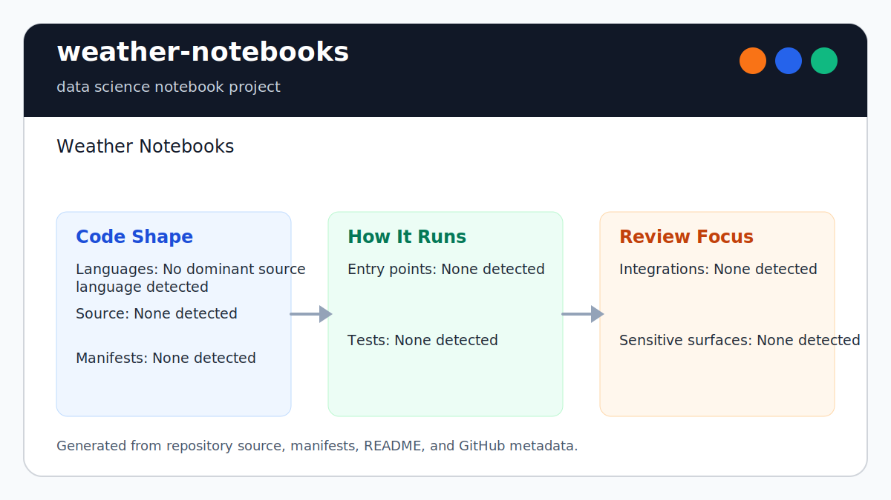

# weather-notebooks

<!-- README-OVERVIEW-IMAGE -->


## Overview

`garethpaul/weather-notebooks` is a data science notebook project. Weather Notebooks

This README is based on the checked-in source, manifests, scripts, and repository metadata on the `master` branch. The project language mix found during review was: no dominant source language detected.

## Repository Contents

- `SECURITY.md` - security reporting and disclosure guidance
- `VISION.md` - project direction and maintenance guardrails

Additional scan context:

- Source directories: no top-level source directories detected
- Dependency and build manifests: none detected
- Entry points or build surfaces: none detected
- Test-looking files: no obvious test files detected

## Getting Started

### Prerequisites

- Git
- Python 3
- A NOAA Climate Data Online API token available as `NOAA_TOKEN`

### Setup

```bash
git clone https://github.com/garethpaul/weather-notebooks.git
cd weather-notebooks
python -m pip install -r requirements.txt
export NOAA_TOKEN=your-noaa-token
```

The setup commands above are derived from repository files. Legacy mobile, Python, or JavaScript samples may require older SDKs or package versions than a modern workstation uses by default.

## Running or Using the Project

- Run `jupyter notebook Weather.ipynb` after installing dependencies and setting `NOAA_TOKEN`.
- The notebook fetches NOAA CDO observations for station `GHCND:US1CAMR0037` across the configured date range.
- NOAA requests explicitly use metric units; Celsius temperatures and
  millimeter precipitation are converted for Fahrenheit/inch presentation.
- NOAA result sets are fetched in 1,000-row pages with a 20-page safety limit
  per request group; exhausting the limit raises instead of silently truncating.

## Testing and Verification

- `make verify` runs static notebook reproducibility, token-safety, date
  alignment, NOAA root/result-shape, observation key, finite numeric value,
  observation value-guard, token whitespace, metric-unit conversion,
  pagination, measurement-row, and empty-row checks. It also runs executable
  fake-HTTP tests for pagination, payload validation, failure propagation,
  request bounds, and unit conversions.
- `make check` runs `make verify` with bytecode cleanup before and after.
- GitHub Actions installs the exact scientific stack and runs offline contracts
  on every push, pull request, and manual dispatch for Python 3.12 and 3.14 on
  Ubuntu 24.04 with read-only permissions, immutable action pins,
  credential-free checkout, and cancellation for superseded runs.
- The hosted matrix also reruns `make check` from an external working directory.
- `python3 scripts/check_weather_notebook_contracts.py` runs just the notebook contracts.
- `python3 -m unittest weather_notebook_tests` runs the executable NOAA helper
  tests without a token or network request.
- Completed maintenance plans live under `docs/plans` and are checked by
  `make check`.

When the required SDK or runtime is unavailable, use static checks and source review first, then verify on a machine that has the matching platform toolchain.

## Configuration and Secrets

- `NOAA_TOKEN` is required to fetch NOAA Climate Data Online data. Keep it in
  your local environment and out of git; blank or whitespace-only values are
  rejected before requests are made.
- Do not commit NOAA API tokens, private datasets, or refreshed outputs without source dates.

## Security and Privacy Notes

- The scan did not identify production authentication, payment, or secret-management code. Treat future additions in those areas as security-sensitive.

## Maintenance Notes

- See `SECURITY.md` for vulnerability reporting and safe research guidance.
- See `VISION.md` for project direction and contribution guardrails.
- See `docs/plans/2026-06-08-weather-notebook-reproducibility.md` for the
  current notebook reproducibility baseline.
- See `docs/plans/2026-06-08-weather-notebook-date-alignment.md` for the NOAA
  datatype date-alignment contract.
- See `docs/plans/2026-06-08-weather-notebook-result-shape.md` for NOAA JSON
  result-shape handling.
- See `docs/plans/2026-06-09-weather-notebook-value-guards.md` for malformed
  NOAA date and numeric value handling.
- See `docs/plans/2026-06-09-weather-notebook-finite-values.md` for NaN and
  infinite NOAA numeric value handling.
- See `docs/plans/2026-06-09-weather-notebook-response-root.md` for explicit
  NOAA response root-shape errors.
- See `docs/plans/2026-06-09-weather-notebook-empty-rows.md` for rejecting
  empty parsed observation sets before plotting.
- See `docs/plans/2026-06-09-weather-notebook-measurement-rows.md` for
  filtering date-valid rows that have no usable converted measurements.
- See `docs/plans/2026-06-09-weather-notebook-observation-keys.md` for
  rejecting non-text NOAA observation date and datatype keys before bucketing.
- See `docs/plans/2026-06-09-weather-notebook-token-whitespace.md` for
  trimming and rejecting blank NOAA token environment values before requests.
- See `docs/plans/2026-06-10-ci-baseline.md` for the GitHub Actions baseline.
- See `docs/plans/2026-06-10-dependency-reproducibility.md` for exact scientific
  stack pins and hosted import verification.
- See `docs/plans/2026-06-10-noaa-pagination.md` for bounded NOAA result
  pagination and explicit safety-limit failure.
- See `docs/plans/2026-06-10-noaa-metric-units.md` for explicit NOAA unit
  scaling and corrected display conversions.

## Contributing

Keep changes small and tied to the project that is already present in this repository. For code changes, document the toolchain used, avoid committing generated dependency directories or local configuration, and update this README when setup or verification steps change.
